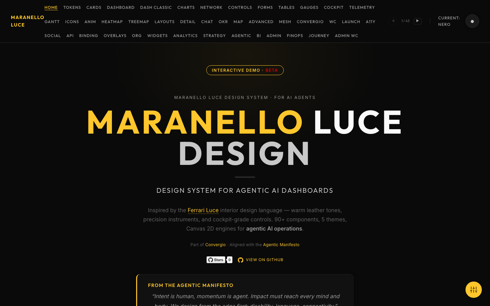
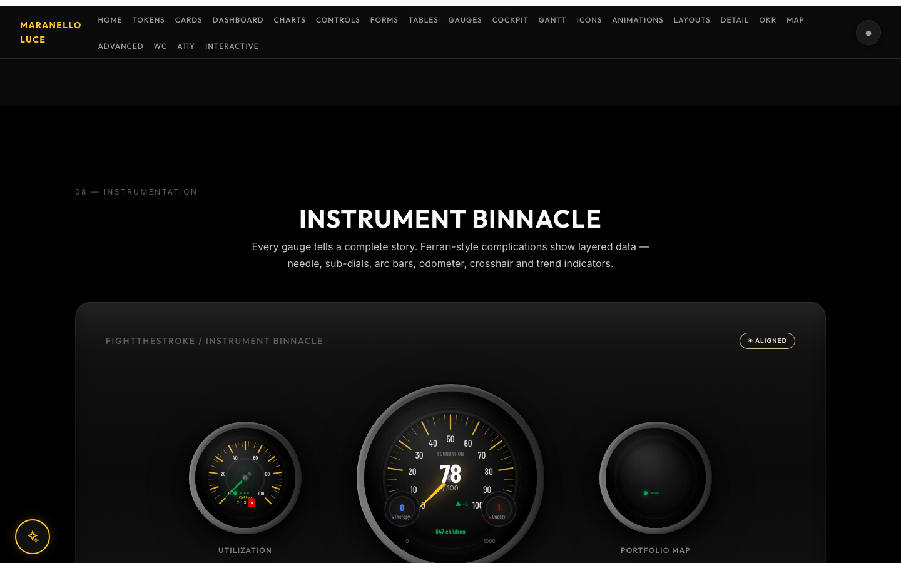
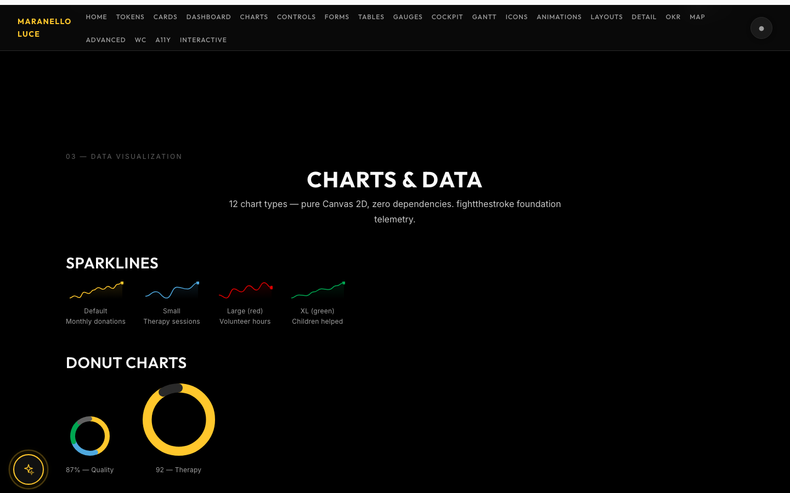
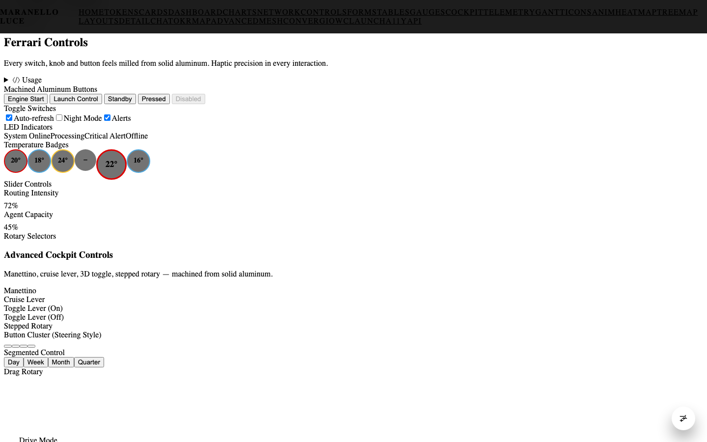
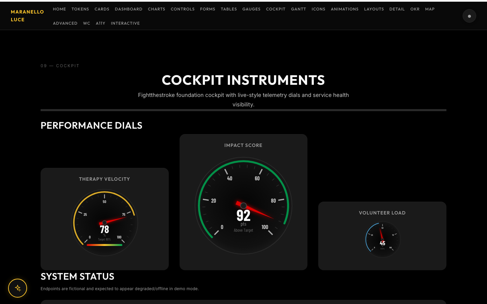
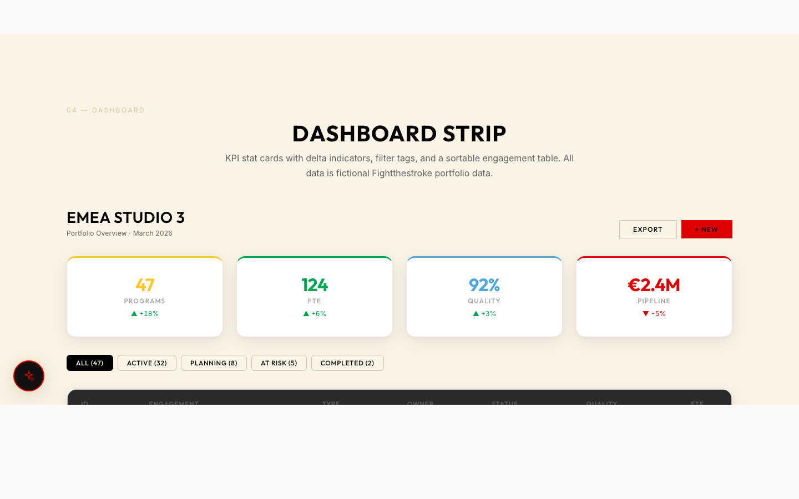
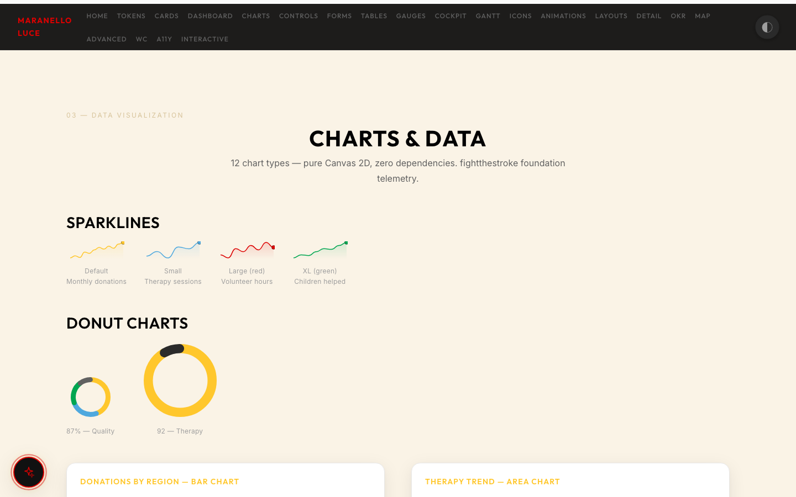

# 🏎️ Maranello Luce Design System

<p align="center">
  
</p>

<p align="center">
  <strong>Ferrari Luce-inspired design system for business dashboards.</strong><br>
  Warm leather tones · Cockpit-grade controls · Canvas data engines<br><br>
  <a href="https://roberdan.github.io/MaranelloLuceDesign/demo/">▶ Live Demo</a> ·
  <a href="#quick-start">Quick Start</a> ·
  <a href="docs/INTEGRATION.md">Integration Guide</a> ·
  <a href="AGENT_GUIDE.md">AI Agent Guide</a>
</p>

<p align="center">
  
  
  
  
  
</p>

---

Part of the [Convergio](https://github.com/Roberdan/MyConvergio) ecosystem.

## Features

| Layer | What | Count |
|-------|------|-------|
| **CSS Tokens** | Colors, spacing, typography, shadows, gradients | 422 tokens |
| **CSS Components** | Cards, buttons, badges, tables, forms, layouts | 92 files |
| **Web Components** | `<mn-gauge>`, `<mn-chart>`, `<mn-gantt>`, `<mn-mapbox>` + 20 more | 24 WCs |
| **Headless JS** | Canvas charts, gauges, speedometers, maps, data tables | 87 APIs |
| **Integration Layer** | Theme bridge, resets, utilities — drop-in for any SPA | 4 modules |

- **4 themes**: Nero (dark), Avorio (warm light), Editorial (mixed), Colorblind (WCAG AA)
- **CSS @layer cascade**: 12 layers for zero-specificity conflicts
- **Grid templates**: 6 responsive presets (`overview-4col`, `sidebar-main`, `masonry-auto`...)
- **Widget containers**: `mn-widget` with title bar, actions, collapse, loading states
- **WCAG 2.2 AA**: keyboard nav, ARIA, `prefers-color-scheme` auto
- **Zero runtime deps**: pure CSS + vanilla TypeScript
- **AI-discoverable**: `components.json` + `AGENT_GUIDE.md` for AI agent integration

## Quick Start

### Git dependency (primary)

```bash
npm install github:Roberdan/MaranelloLuceDesign#v3.2.0
```

### CDN (no build step)

```html
<!-- CSS -->
<link rel="stylesheet" href="https://cdn.jsdelivr.net/gh/Roberdan/MaranelloLuceDesign@v3.2.0/dist/css/index.css">

<!-- JS (IIFE -- attaches to window.M) -->
<script src="https://cdn.jsdelivr.net/gh/Roberdan/MaranelloLuceDesign@v3.2.0/dist/iife/maranello.min.js"></script>
```

### ESM import (per-component, tree-shakeable)

```js
// Full bundle
import { charts, gantt, gauge } from 'maranello-luce-design-business';
import 'maranello-luce-design-business/css';

// Per-component sub-package imports
import { charts } from 'maranello-luce-design-business/charts';
import { gauge } from 'maranello-luce-design-business/gauge';
import { gantt } from 'maranello-luce-design-business/gantt';
import { controls } from 'maranello-luce-design-business/controls';
```

## Themes

| Theme | Class | Accent | Background |
|-------|-------|--------|------------|
| Editorial | (default) | Giallo Ferrari | Mixed dark/light sections |
| Nero | `mn-nero` | Giallo Ferrari | Full dark (`#0a0a0a`) |
| Avorio | `mn-avorio` | Rosso Corsa | Warm ivory (`#f5e5c7`) |
| Colorblind | `mn-colorblind` | High-contrast blue | Inherits base |

Apply a theme by adding the class to `<body>`:

```html
<body class="mn-nero">
```

Auto-switching with `prefers-color-scheme`:

```js
import { initThemeToggle } from 'maranello-luce-design-business';
initThemeToggle(); // Respects OS dark/light preference
```

See [docs/THEMING.md](docs/THEMING.md) for custom themes and token overrides.

## Token System

All visual properties are CSS custom properties (tokens) defined in `tokens.css`. Override any token for custom branding:

```css
:root {
  --giallo-ferrari: #your-brand-color;
  --mn-accent: var(--giallo-ferrari);
  --font-display: 'YourBrandFont', var(--font-display);
}
```

Key token categories: colors (nero, grigio, avorio, accento, semantic), typography (display, body, mono), spacing (4px base scale), borders, shadows, transitions, z-index layers.

## CSS @layer Architecture

v3.2.0 wraps all 70 CSS source files in explicit `@layer` blocks. The 11 layers, in cascade order:

| Layer | Contents |
|-------|----------|
| `tokens` | CSS custom properties — colors, spacing, typography |
| `base` | Reset, root, font-face |
| `themes` | Nero, Avorio, Colorblind overrides |
| `typography` | Heading, body, mono styles |
| `layouts` | Grid, flex, section containers |
| `components` | Buttons, cards, tags, tables, nav |
| `forms` | Inputs, selects, checkboxes |
| `controls` | Ferrari dials, sliders, rotary |
| `charts` | Chart containers and legends |
| `animations` | Transitions, keyframes |
| `utilities` | Helpers, overrides |

Consumer styles added without `@layer` automatically win over all system layers.

## Architecture

```
Layer 1: CSS-Only          Layer 2: Web Components       Layer 3: Headless JS
(tokens, layouts,          (mn-* custom elements,        (Canvas/SVG renderers,
 components, forms)         declarative API)              full programmatic control)
```

### Layer 1 -- CSS-Only

Import just the CSS for layout primitives, typography, forms, and component styling. No JavaScript required.

```html
<link rel="stylesheet" href="maranello-luce-design-business/css">
<div class="mn-section-dark">
  <h2 class="mn-title-section">Dashboard</h2>
  <div class="mn-stat-card">
    <span class="mn-stat-value">142</span>
    <span class="mn-stat-label">Active projects</span>
  </div>
</div>
```

### Layer 2 -- Web Components (Dual-mode)

Custom elements with `mn-` prefix. Work in any framework or plain HTML. v3 uses `async resolveEngine()` — no `window.Maranello` polling required.

**ESM mode** (recommended — per-component import):

```html
<script type="module">
  import 'maranello-luce-design-business/wc/mn-gauge';
  import 'maranello-luce-design-business/wc/mn-chart';
</script>
<mn-gauge value="72" label="CPU" theme="nero"></mn-gauge>
<mn-chart type="donut" data='[{"label":"A","value":30},{"label":"B","value":70}]'></mn-chart>
```

**CDN mode** (all WCs via IIFE, no build step):

```html
<link rel="stylesheet" href="https://cdn.jsdelivr.net/gh/Roberdan/MaranelloLuceDesign@v3.2.0/dist/css/index.css">
<script src="https://cdn.jsdelivr.net/gh/Roberdan/MaranelloLuceDesign@v3.2.0/dist/iife/maranello.min.js"></script>
<mn-gauge value="72" label="CPU" theme="nero"></mn-gauge>
<mn-data-table src="/api/data" sortable paginate></mn-data-table>
<mn-toast message="Saved" type="success" duration="3000"></mn-toast>
```

### Layer 3 -- Headless JS

Full programmatic control over Canvas/SVG renderers. Tree-shakeable ESM exports.

```js
import { charts } from 'maranello-luce-design-business/charts';
import { gantt } from 'maranello-luce-design-business/gantt';
import { gauge } from 'maranello-luce-design-business/gauge';

charts.renderDonut(canvas, data, options);
gantt.render(container, tasks, { palette: 'nero' });
gauge.create(canvas, { value: 72, label: 'RPM' });
```

## Component Catalog

### CSS Components
Buttons, stat cards, tags, dividers, tables, status indicators, navigation bars, footers, input groups, form controls, filter chips, page headers, sidebars, toolbars, drawers, notification panels

### Web Components (`mn-*`)
`mn-gauge`, `mn-chart`, `mn-gantt`, `mn-data-table`, `mn-date-picker`, `mn-funnel`, `mn-map`, `mn-hbar`, `mn-speedometer`, `mn-toast`, `mn-modal`, `mn-tabs`, `mn-theme-toggle`, `mn-command-palette`, `mn-login`, `mn-profile`, `mn-chat`, `mn-detail-panel`, `mn-system-status`, `mn-ferrari-control`, `mn-okr`, `mn-a11y`

### Headless JS Engines
Charts (donut, area, bar, bubble, sparkline, sparkbar, radar, half-gauge, live), Gantt timeline, Gauge/Speedometer (Ferrari instrument cluster), Funnel/Sankey, Data Table (sort/filter/paginate), Map View (Mapbox), HBar charts, OKR panels, Forms validation, Controls (rotary, slider, Ferrari dials)

### Layouts
Data tables (standard, compact, panel), detail panels (base, comments, Gantt), org trees, heatmaps, capacity heatmaps, network graphs, command palette, chat, login, sim panels, horizontal bars, funnels

## Integration Guides

| Framework | Guide |
|-----------|-------|
| Vanilla JS | [docs/INTEGRATION_VANILLA.md](docs/INTEGRATION_VANILLA.md) |
| React | [docs/INTEGRATION_REACT.md](docs/INTEGRATION_REACT.md) |
| Svelte | [docs/INTEGRATION_SVELTE.md](docs/INTEGRATION_SVELTE.md) |
| Vue | [docs/INTEGRATION_VUE.md](docs/INTEGRATION_VUE.md) |
| Vite | [docs/INTEGRATION_VITE.md](docs/INTEGRATION_VITE.md) |
| Theming | [docs/THEMING.md](docs/THEMING.md) |

## Development

```bash
npm install          # Install dev dependencies
npm run build        # Full build (JS + CSS + WC + fonts + assets + types)
npm run dev          # Serve demo page at localhost:3000
npm run test:unit    # Run unit tests (Vitest)
npm run test:e2e     # Run E2E tests (Playwright)
```

## Project Structure

```
src/
  css/       CSS tokens, themes, components, layouts, forms, controls
  ts/        Headless JS engines (charts, gantt, gauge, controls, etc.)
  wc/        Web Components (mn-* custom elements)
  fonts/     GT Walsheim Pro, JetBrains Mono
  assets/    SVG icons, brand assets
dist/
  css/       Compiled CSS (individual + index.css bundle)
  esm/       ES modules
  cjs/       CommonJS modules
  iife/      IIFE bundle (maranello.min.js)
  types/     TypeScript declarations
  wc/        Web Component bundles
  fonts/     Font files
```

## Examples

### Dashboard with stat cards and gauge

```html
<body class="mn-nero">
  <div class="mn-section-dark" style="padding: 2rem">
    <h2 class="mn-title-section">Operations Dashboard</h2>
    <div style="display: grid; grid-template-columns: repeat(3, 1fr); gap: 1rem">
      <div class="mn-stat-card">
        <span class="mn-stat-value">1,247</span>
        <span class="mn-stat-label">Total Users</span>
        <span class="mn-tag mn-tag--success">+12%</span>
      </div>
      <div class="mn-stat-card">
        <span class="mn-stat-value">98.7%</span>
        <span class="mn-stat-label">Uptime</span>
      </div>
      <div class="mn-stat-card">
        <mn-gauge value="72" label="CPU" min="0" max="100"></mn-gauge>
      </div>
    </div>
    <mn-chart type="area" data='[{"x":1,"y":20},{"x":2,"y":45},{"x":3,"y":30}]'></mn-chart>
  </div>
</body>
```

### Data table with filters

```html
<mn-data-table
  src="/api/projects"
  sortable
  paginate
  page-size="20"
  theme="nero">
</mn-data-table>
```

### Ferrari-style controls

```html
<mn-ferrari-control type="rotary" label="Volume" min="0" max="100" value="65"></mn-ferrari-control>
<mn-speedometer value="7200" max="9000" label="RPM" theme="nero"></mn-speedometer>
```

### Gantt timeline

```html
<mn-gantt
  data='[{"name":"Design","start":"2026-01-01","end":"2026-02-15"},{"name":"Dev","start":"2026-02-01","end":"2026-04-30"}]'
  theme="nero">
</mn-gantt>
```

### Accessibility panel

```html
<mn-a11y></mn-a11y> <!-- Adds font-size, contrast, motion controls -->
```

See the [live demo](https://roberdan.github.io/MaranelloLuceDesign/) for a full component gallery.

## Integration Layer (NEW in v3.2.0)

Drop-in theming for any SPA. One CSS import activates the full Maranello palette:

```html
<!-- Add to your app -->
<link rel="stylesheet" href="dist/css/integration.css">
<body data-theme="maranello">
```

Now use semantic CSS variables everywhere:

```css
.my-card {
  background: var(--bg-panel);
  border: 1px solid var(--border);
  color: var(--text);
}
.my-card:hover {
  box-shadow: var(--shadow-elevated);
  border-color: var(--accent);
}
```

**Utility classes included**: `mn-panel`, `mn-badge--success`, `mn-btn-accent`, `mn-status-dot--danger`, `mn-gradient-text`, `mn-fade-in`

**Grid templates**: `mn-grid-template--overview-4col`, `mn-grid-template--sidebar-main`, `mn-grid-template--masonry-auto`

**Widget containers**: `mn-widget` with `mn-widget__header`, `mn-widget__body`, `mn-widget__actions`

## Preview

> **[▶ Live Demo](https://roberdan.github.io/MaranelloLuceDesign/demo/)** — 23 interactive sections, 87 APIs, 4 themes

<details open>
<summary><strong>🌙 Nero Theme (Dark)</strong></summary>

<p align="center">
  
</p>

<p align="center">
  
</p>

<p align="center">
  
</p>

<p align="center">
  
</p>

</details>

<details>
<summary><strong>☀️ Avorio Theme (Light)</strong></summary>

<p align="center">
  
</p>

<p align="center">
  
</p>

</details>

## Sponsor ❤️

This project uses fictional data inspired by [**Fightthestroke Foundation**](https://www.fightthestroke.org/) — an Italian non-profit supporting children affected by stroke through technology and therapy.

**[🫶 Donate to Fightthestroke](https://www.fightthestroke.org/donorbox)** — every euro funds therapy programs for children.

## Copyright

(c) Roberdan 2026 — Roberto D'Angelo

## License

[MIT](LICENSE) — Use freely in personal and commercial projects.
